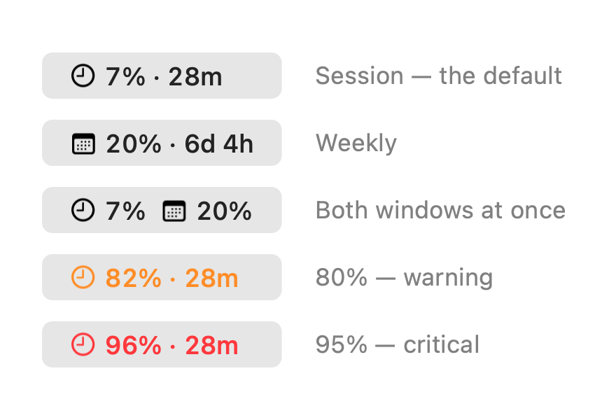
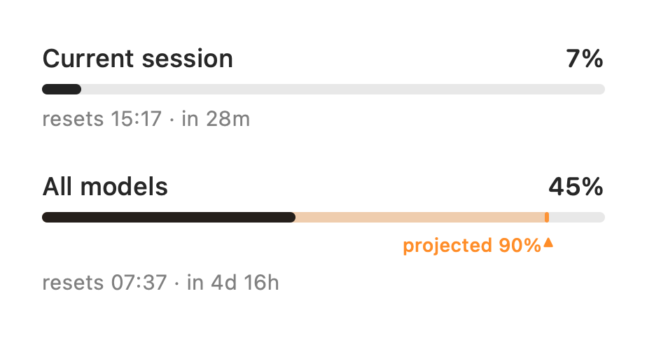

# ClawBar


[](LICENSE)
[](https://github.com/vmlrodrigues/ClawBar/releases/latest)

[](https://github.com/vmlrodrigues/ClawBar/releases/latest/download/ClawBar.dmg)

Your Claude subscription usage in the menu bar — the **5-hour session window** and the
**weekly limit**, with reset countdowns, a projection of where the week is heading, and
warnings before you run out.

<picture>
  <source media="(prefers-color-scheme: dark)" srcset="docs/menubar-dark.png">
  
</picture>

No dock icon. Around 15 MB and 0% CPU between checks. Signed with a Developer ID and
notarised by Apple, so Gatekeeper stays quiet.

---

## What it shows

**In the menu bar**, always visible: a glyph for which window you are looking at — a clock
for the session, a calendar for the week — the percentage used, and how long until it
resets. A global shortcut (⌃⌥⌘U by default, rebindable) cycles session → weekly → both
without touching the mouse.

The figure turns **orange at 80%** and **red at 95%**. Nothing below that, deliberately:
a colour that fires when nothing needs doing is a colour you stop reading.

**Click it** for both windows in full:

<picture>
  <source media="(prefers-color-scheme: dark)" srcset="docs/windows-dark.png">
  
</picture>

- Percentage used, a progress bar, and when the window resets — named by day, so
  `resets Thu 05:00 · in 4d 8h` rather than an ambiguous bare time.
- **A projection for the week.** A translucent extension of the bar shows where you are
  heading, with the figure on a caret beneath it. If you are heading past 100%, chevrons
  appear beyond the bar's right edge — `›`, `››`, `›››` — because a clamped bar cannot
  tell you whether you will scrape past the limit or blow through it twice over.
- **Usage credits**, if you have them and have used any.
- How fresh the reading is, which turns amber past five minutes.

Notifications fire at **80%** and **95%** per window, once per crossing.

## Requirements

- macOS 14 or later, on **Apple Silicon** — there is no Intel build
- A Claude **Pro** or **Max** subscription
- **Claude Code**, once, to mint a token

That last one catches people out. Claude Desktop does not include the Claude Code CLI, so
if you only use Claude for chat and Cowork you will still need to install it — but only to
run one command. You never have to use it again, and a token lasts about a year. ClawBar
detects whether it is present and tells you.

## Install

1. [**Download ClawBar.dmg**](https://github.com/vmlrodrigues/ClawBar/releases/latest/download/ClawBar.dmg)
   and drag it to Applications.
2. Launch it. It will ask for a token.
3. In a terminal:
   ```sh
   claude setup-token
   ```
4. Paste the result into the window.

The token is stored in your login Keychain and sent only to `api.anthropic.com`. ClawBar
updates itself from here on, via Sparkle.

## How it works, and what that costs you

There is no public API for subscription usage. Every documented endpoint — Admin Usage &
Cost, Claude Code Analytics, Enterprise Analytics — is gated behind a Console organisation,
which individual Pro and Max accounts do not have.

So ClawBar makes one minimal request to `/v1/messages` and reads the
`anthropic-ratelimit-unified-*` **response headers**. The reply is discarded; the headers
are the payload.

Three consequences worth understanding before you rely on it.

**These headers are undocumented.** They are not in Anthropic's published response-header
table. They can change shape or vanish without notice, and if they do, ClawBar breaks.
[VERIFICATION.md](VERIFICATION.md) records exactly what was observed and how, so a future
failure can be diagnosed rather than guessed at.

**The figure can read one point below Claude's own Usage panel.** The header carries two
decimal places and the server floors to them, so `0.28` means anywhere in 28.00–28.99%.
Claude's panel has the full-precision number and rounds it. That precision is not
recoverable, so ClawBar shows what it was given.

**Checking costs a request.** A tiny one — 8 input and 1 output token on Haiku, which did
not move reported utilisation across 110 logged samples — but a real inference call, and it
appears to anchor a 5-hour session window. So ClawBar checks on evidence that you are
*already* using Claude Code, watching `~/.claude`, rather than on a fixed timer. Settings →
Background refresh controls what happens once you stop; set it to **Off** if you want your
session window aligned strictly to your own first request.

## Privacy

- Your token lives in the login Keychain. Never on disk in plain text, never in logs.
- The only network destinations are `api.anthropic.com` and this repository, for updates.
  No telemetry, no analytics.
- The optional usage log at `~/Library/Application Support/ClawBar/usage-log.jsonl`
  records utilisation percentages and reset timestamps. No token, no prompts, no
  conversation content. Turn it off in Settings.

## Building from source

```sh
swift package resolve
./Scripts/build.sh            # SIGN=0 to skip code signing
```

Builds for the host architecture and signs it with the first Developer ID in your Keychain.
Releases are Apple Silicon only; `--arch arm64 --arch x86_64` would make it universal if you
want that in a fork.

The version comes from the `VERSION` file and changes only when a release is cut; the
build number is the git commit count, derived automatically. Sparkle compares the build
number, so it must always increase — deriving it removes any chance of a duplicate, which
would silently break updates for anyone already on that build.

Releasing additionally needs an App Store Connect API key — copy `.env.example` to `.env`
— then:

```sh
./Scripts/notarize.sh         # notarise app + DMG, staple both
./Scripts/appcast.sh          # sign for Sparkle, update appcast.xml
```

The icon is generated rather than drawn:

```sh
swift Scripts/make-icon.swift
iconutil -c icns dist/AppIcon.iconset -o Resources/AppIcon.icns
```

## Design notes

[DESIGN.md](DESIGN.md) covers the architecture and the reasoning behind the choices that
are not obvious — why checking is gated on filesystem activity, why the status item is
AppKit while everything else is SwiftUI, why the projection uses the rate since the last
reset rather than a recent one, and why the menu bar never labels a window with a
duration-shaped string.

[BACKLOG.md](BACKLOG.md) lists the known gaps, and the things deliberately not done with
the reasoning for each.

## Not affiliated with Anthropic

ClawBar is an independent, unofficial tool. It is not made, endorsed, or supported by
Anthropic. "Claude" and "Anthropic" are trademarks of Anthropic PBC, used here only to
describe what the app does. It relies on undocumented behaviour and may stop working at
any time — use it accordingly.

## Licence

MIT — see [LICENSE](LICENSE). Sparkle is used under the MIT licence, © Sparkle Project
contributors.
